# Final submission screenshots

These frames were extracted from the final Windows build recordings captured on
25 September 2026. They document the submitted application state without
requiring Unity to be opened.

The source recordings were:

- **Recording A:** `Power-to-Methanol Digital Twin 2026-09-25 19-56-04.mp4`
- **Recording B:** `Power-to-Methanol Digital Twin 2026-09-25 19-59-40.mp4`

Screenshots are stored in `docs/screenshots/final/`.

## Application entry and guidance

### Welcome screen — Recording A, 00:02

The application opens with the final Daylight presentation, a concise project
description, and a clear Start action.

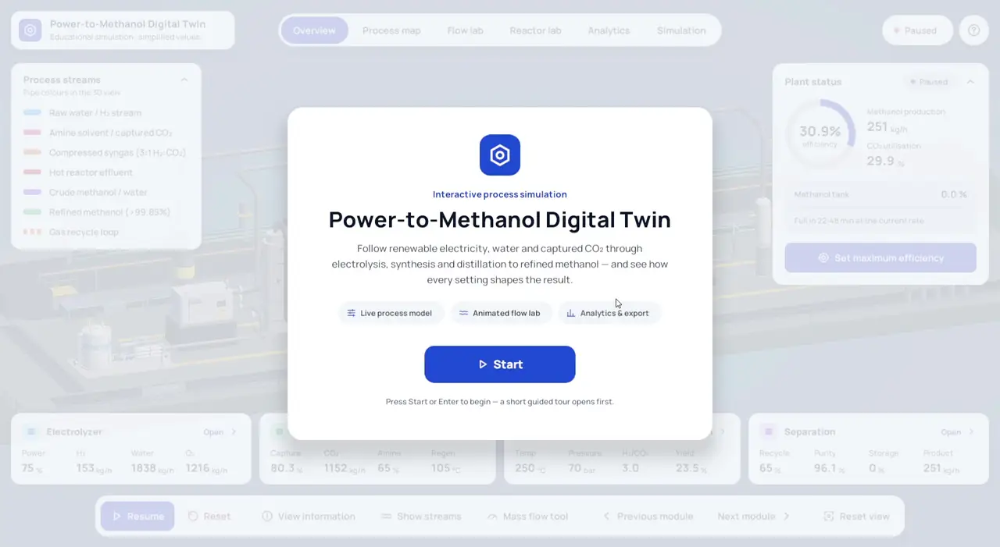

### Guided tutorial — Recording A, 00:08

The guided tour explains the main application navigation before the user begins
exploring the plant.

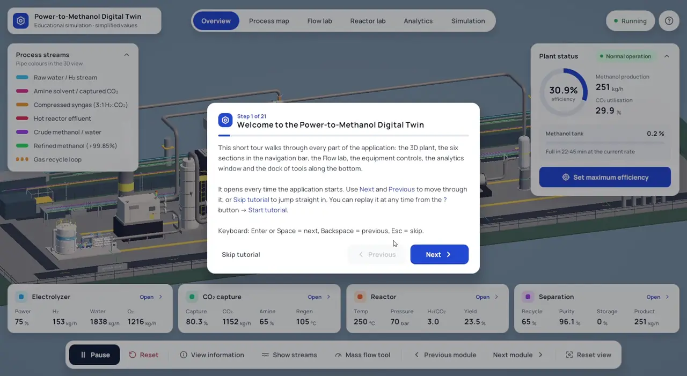

## Whole-plant interface and flow visualization

### Daylight dashboard overview — Recording A, 00:37.8

The full-plant overview shows the process-stream legend, complete plant model,
live plant-status card, KPI/module cards, navigation and bottom controls.

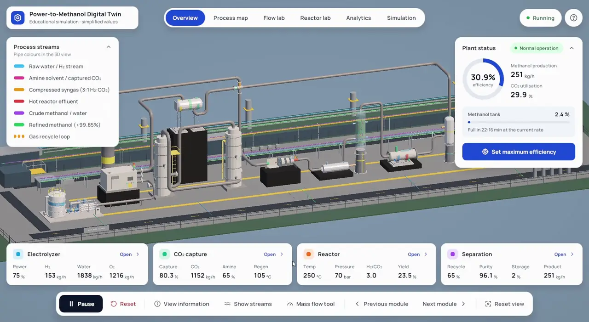

### Flow Lab and stream legend — Recording A, 00:39.5

Flow Lab exposes the stream groups while the 3D view shows the final
stream-specific pipe colors across the process.

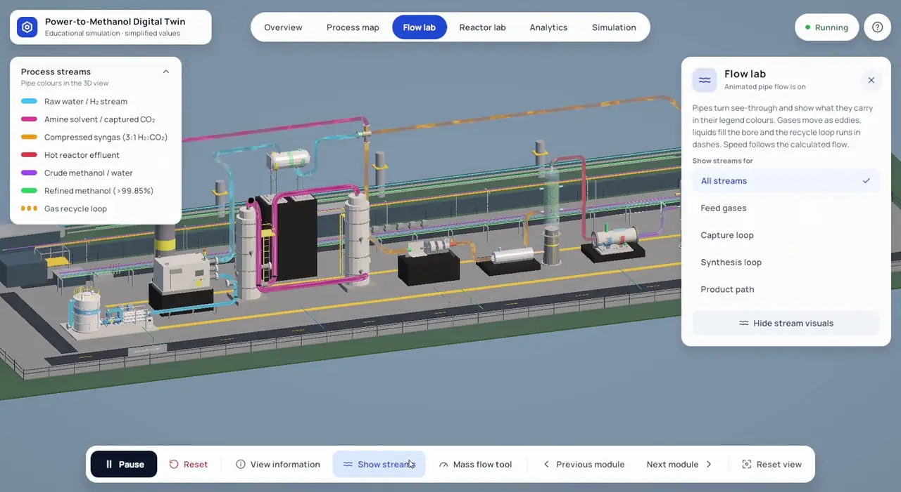

## Guided process map

### Renewable power and water — Recording A, 00:46

The Process Map begins at the renewable-power/water side of the PtMeOH chain
and guides the viewer through the plant.

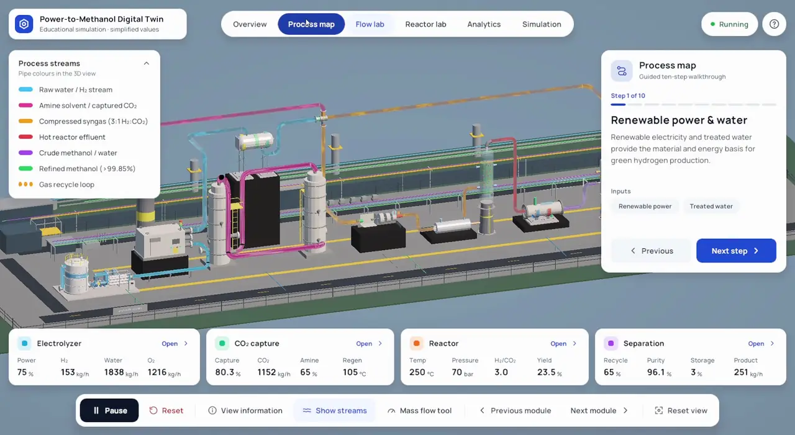

### CO₂ capture — Recording A, 00:50

The camera focuses the capture section while the Process Map explains the
amine-based capture stage.

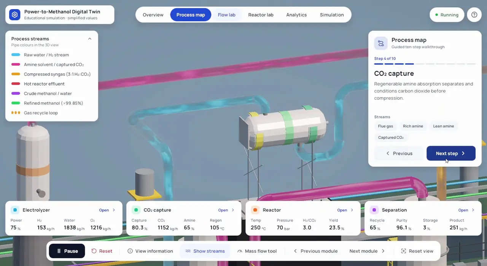

### Methanol reactor — Recording A, 00:54

The reactor step combines a close equipment view with the visible internal
reactor-flow visualization.

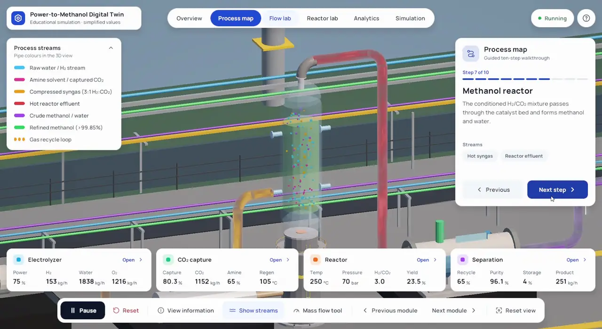

### Methanol storage — Recording A, 01:02

The final process-map stage follows purified methanol into storage.

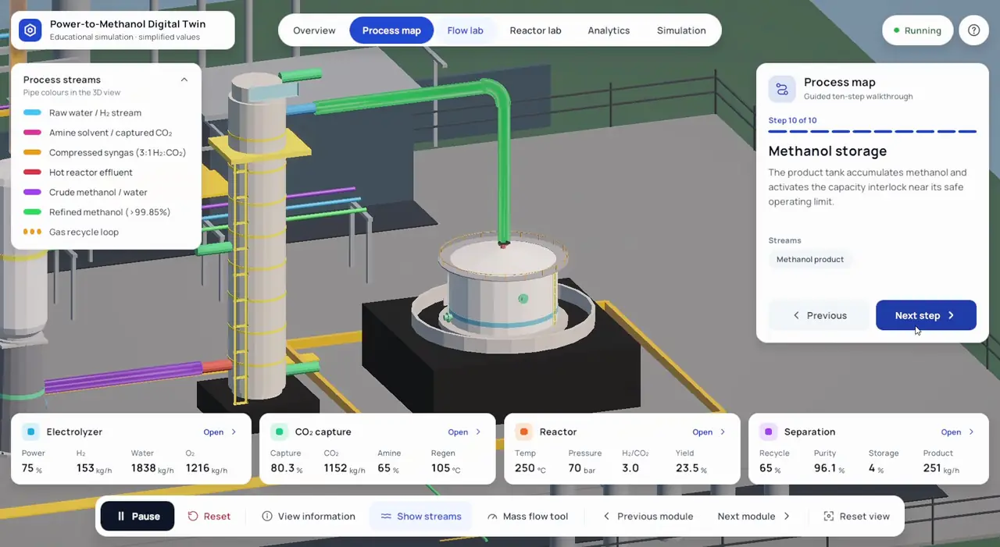

## Live process behavior

### Safety warning state — Recording A, 01:12

The application surfaces an operating-limit warning while retaining the
whole-plant context and live KPIs.

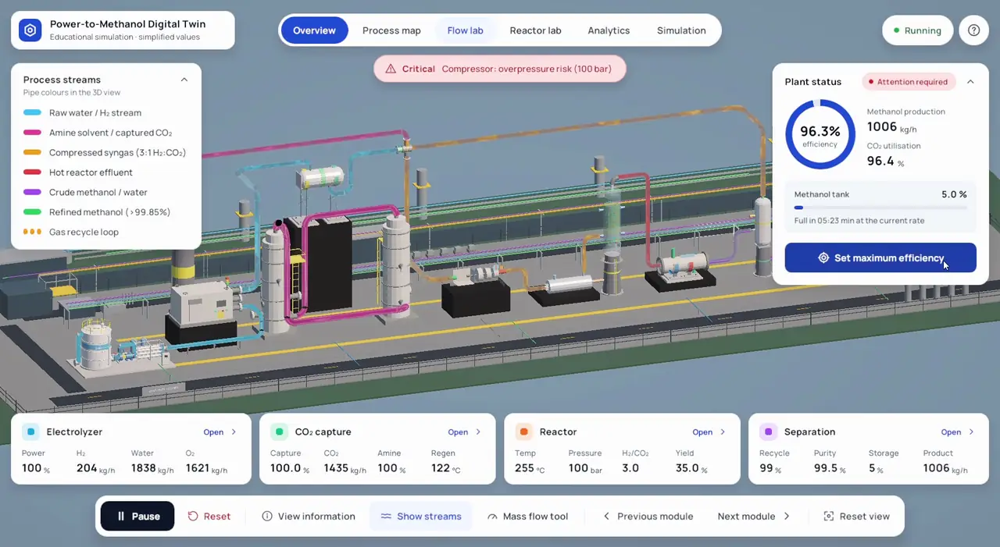

### Simulation summary — Recording B, 00:06

The Simulation view summarizes plant state and provides quick access to the
major process modules.

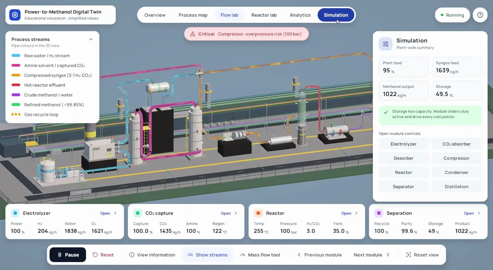

## Reactor and equipment interaction

### Live reactor reaction card — Recording B, 00:10

Hovering the reactor exposes the modeled reaction and live engineering values,
connecting the 3D equipment to the process model.

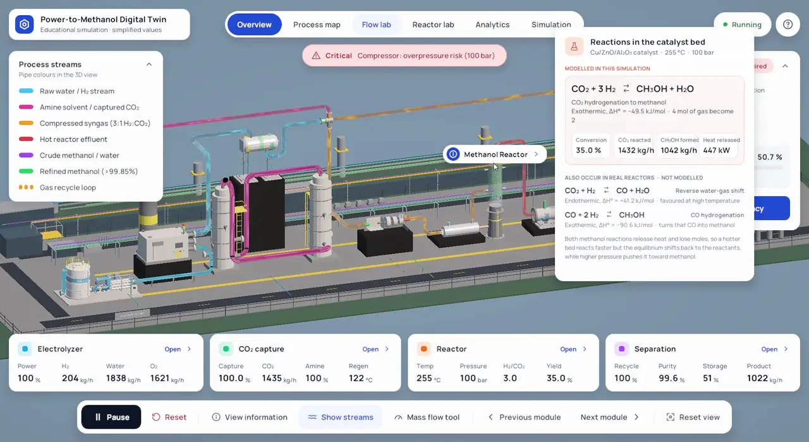

### Reactor operating controls — Recording B, 00:16

The synthesis drawer exposes reactor operating inputs while the live plant
remains visible behind it.

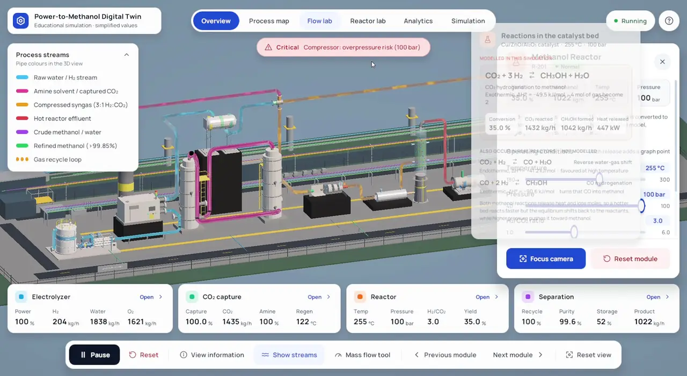

### Desorber / regenerator controls — Recording B, 00:40

The carbon-capture equipment drawer demonstrates the scrollable module-control
layout and live operating values.

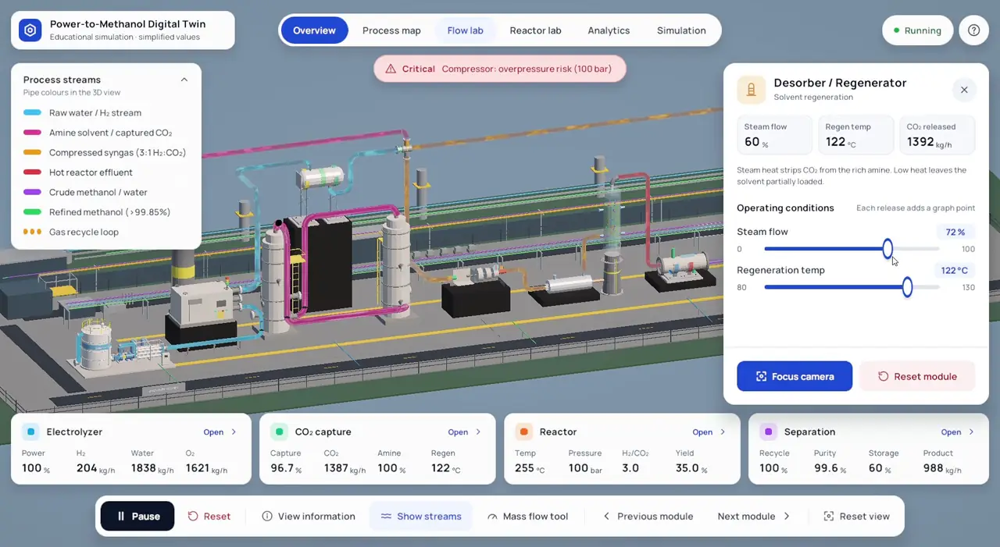

### Equipment close-up — Recording B, 00:52

A focused camera view demonstrates equipment-level navigation while preserving
the process-stream context and module controls.

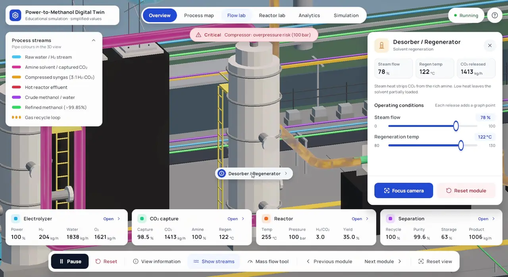

## What the gallery demonstrates

Together these frames document the final submission's:

- Daylight UI and application shell;
- welcome screen and guided tutorial;
- full-plant 3D overview and process-stream legend;
- Flow Lab and continuous colored stream visualization;
- guided Process Map across major PtMeOH stages;
- water/electrolysis, CO₂ capture, synthesis and storage sections;
- live plant KPIs and operating warnings;
- reactor cutaway/reaction presentation;
- module-specific operating controls; and
- equipment-focused camera navigation.

The screenshots are presentation evidence only; the implementation and
engineering details are documented in
[FINAL_PROJECT_REPORT.md](FINAL_PROJECT_REPORT.md) and
[IMPLEMENTATION_REFERENCE.md](IMPLEMENTATION_REFERENCE.md).
