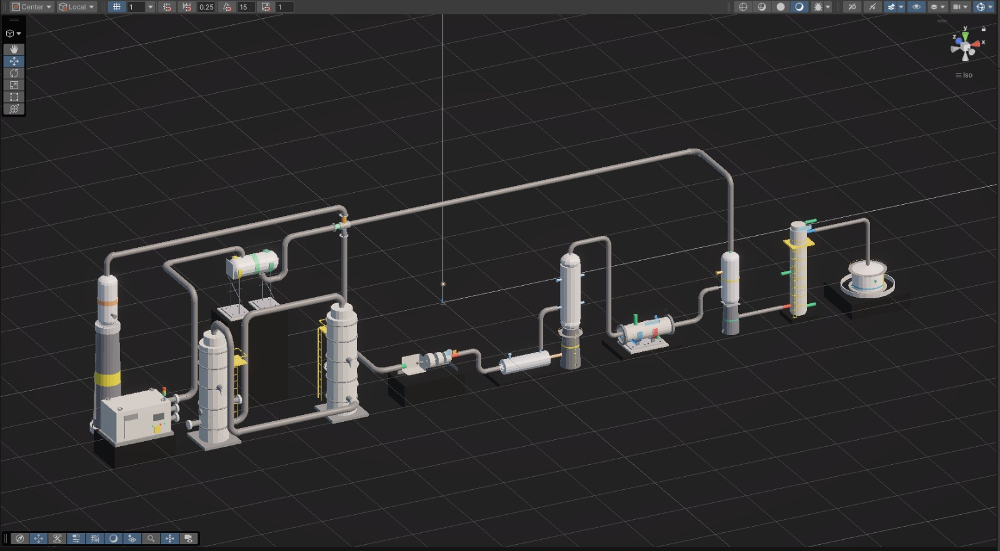
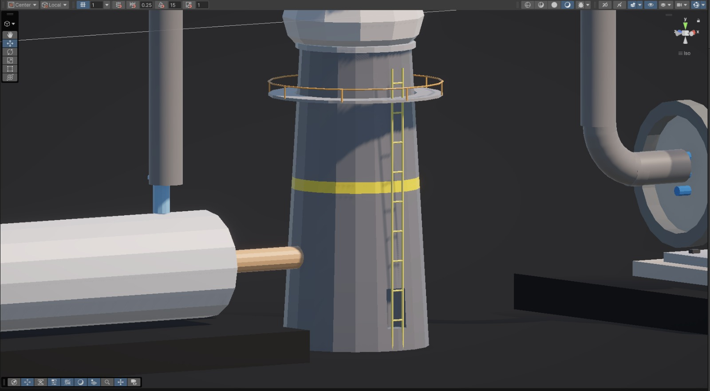

# Development screenshots

This page keeps some of the screenshots used during development so that the
progress of the project can be seen without opening Unity. Some of these images
show earlier stages of the project and are therefore not identical to the
final submission build.

For the current Windows-build visuals, see the
[final submission screenshot gallery](final-screenshots.md), which contains
curated frames and source-video timestamps from the 25 September 2026 final
recordings.

## Full-plant development

The full-plant scene was built by integrating the main PtM equipment, pipe
routes, support structures and camera navigation into one Unity scene. At this
stage the overall plant layout was already in place, while the flow system and
UI were still being developed.

## Reactor prototype

The reactor interaction prototype was one of the earlier focused parts of the
project. It was used to test controls for temperature, pressure, GHSV and
H2/CO2 ratio together with methanol-yield calculation and internal particle
flow.

The final submission keeps the same basic idea, but the reactor is now part of
the complete plant. Its internal flow is constrained inside the reactor
geometry and is linked to the shared process model.

## Equipment-detail work

This screenshot shows some of the work carried out around platforms, ladders,
supports and equipment connections.

## UI reference used during development

The ICODOS-style reference below was used as a visual direction while the
dashboard was being redesigned.

The final application does not reproduce this interface directly. It uses the
same general idea of a clean industrial dashboard with module navigation,
stream colours, KPIs and process values, but it was implemented as a
Unity-native Daylight interface.

## Changes completed after these screenshots

After these development images were captured, the project was extended with
continuous pipe flow, water treatment, live process coupling, the final
Daylight dashboard, analytics, warnings, improved camera controls, the welcome
screen/tutorial and the final reactor visualization.

For the current project state, see the
[final screenshot gallery](final-screenshots.md), the
[final project report](FINAL_PROJECT_REPORT.md), and the
`submission_final` branch.
